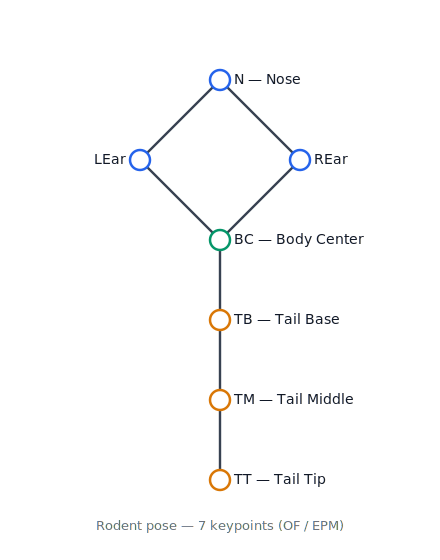

# NeoLabel

Software for video-based pose annotation — build Machine Learning datasets
for pose estimation and behavioral analysis. The primary use case is
**infant pose annotation**, and the same workflow applies to **rodent
behavior experiments** such as **Open Field (OF)** and **Elevated Plus
Maze (EPM)**. Create projects, upload videos, annotate frames with
keyboard shortcuts, and export the result.

<p align="center">
  
  <br>
  <sub><em>NeoLabel sign-in — entry point to projects, videos, and annotation.</em></sub>
</p>

> The full specification — domain model, API reference, and roadmap —
> lives in **[SPEC.md](./SPEC.md)**.

## Features

- **Authentication** by username/password (JWT) with roles (`admin`,
  `annotator`, `reviewer`). Destructive bulk operations (delete project,
  delete all annotated items) are admin-only.
- **Projects** with types:
  - **Pose detection** — keypoint annotation on video frames with
    FFmpeg-based extraction. Two schemas in use today:
    - **Infant pose** — 17 COCO keypoints with an interactive baby
      avatar as a visual guide.
    - **Rodent pose** — 7 keypoints (`N` nose, `LEar`/`REar`, `BC`
      body center, `TB`/`TM`/`TT` tail base/middle/tip) for behavioral
      assays such as **Open Field (OF)** and **Elevated Plus Maze
      (EPM)**.

    New schemas can be defined as the need arises.
  - **Image segmentation** (roadmap).

<p align="center">
  
  <br>
  <sub><em>Rodent keypoint schema currently in use.</em></sub>
</p>
- **Admin-only video upload** — optionally assigned to a specific
  annotator, or left in the admin pool (extracted frames with no
  assignee). Admins can reassign a whole video to another user, clear
  the assignment, or delete it (removing frames and annotations).
- **Per-user visibility** — annotators only see projects and items
  assigned to them; admins see everything.
- **Scale-ready project page**:
  - Videos table with search, assignee filter, per-row progress bar and
    totals.
  - Items section with status tabs, per-video filter, list/grid view,
    client-side pagination, and the assigned annotator shown on every
    row (dashed/italic when unassigned).
- **Annotation UI**:
  - Mouse or full-keyboard workflow (arrows + Enter/Space).
  - Shortcuts: `Tab`/`N` next keypoint, `1`–`9` jump, `O` hidden, `U`
    undo, `[` / `]` previous/next item.
  - Undo history (50 steps), clear point / clear all.
  - Auto-save on every action.
  - **Traversal order** — choose top-to-bottom (default), left-contour,
    or right-contour; clicking any point always overrides the pointer.
    Output array order is unchanged across modes.
  - **Reuse previous frame as template** — optional toggle that prefills
    a new frame with the previous frame's keypoints so you only drag to
    adjust. Safe to turn on/off mid-session.
- **Export** in JSON, JSONL, CSV, **YOLO-pose ZIP** (Ultralytics-ready,
  COCO 17 keypoints), and **Full bundle ZIP** (`annotations.json` +
  every referenced source frame, portable across machines) for pose
  projects. Text formats and the bundle include every item (pending
  rows carry `annotation: null`); YOLO naturally only ships annotated
  frames. Downloads are streamed with a progress bar and cancellable.

## Stack

- **Backend:** Python 3.12, FastAPI, Pydantic v2, filesystem JSON storage
  (no database), JWT + bcrypt, FFmpeg for videos.
- **Frontend:** React 18 + TypeScript, Vite, TailwindCSS, TanStack Query,
  Zustand, React Router, React Hook Form.

## Setup

```bash
cp .env.example .env
cp seed_users.example.json seed_users.json
# edit seed_users.json with the credentials you want
```

`seed_users.json` is **git-ignored** and is read on every backend
startup:

- Users listed here are **created** if they don't exist yet.
- If a listed user already exists, their **password and role are
  reconciled** to match the file — so editing the password and
  restarting the backend is the supported way to rotate credentials.
- Users not listed in the file are left untouched. To prune users that
  were removed from `seed_users.json`, run the reconciliation script:

  ```bash
  # dry-run (prints what would change, touches nothing)
  docker compose exec backend python -m scripts.reconcile_seed_users
  # apply
  docker compose exec backend python -m scripts.reconcile_seed_users --apply
  ```

  The script always preserves `admin`, unassigns any orphaned item
  references, and lists projects whose `owner_id` would become orphaned
  for manual review.

If you skip the file entirely, no users are created automatically — use
the register screen.

Format:

```json
[
  { "username": "admin",      "password": "change-me", "role": "admin" },
  { "username": "annotator1", "password": "change-me", "role": "annotator" }
]
```

Accepted roles: `admin`, `annotator`, `reviewer`.

## Running

The recommended dev workflow is Docker — it bundles FFmpeg, pins the
Python/Node versions, and mounts source code for hot-reload.

### Docker (recommended)

```bash
docker compose up --build -d
```

Or use the interactive menu, which wraps the same commands:

```bash
python run.py
```

Menu options: up (build + start), down, logs (follow), status, open UI,
run backend tests.

### Native

Requires Python 3.12, Node 18+, and FFmpeg on `PATH`.

```bash
# Backend
cd backend
uvicorn app.main:app --reload

# Frontend (separate terminal)
cd frontend
npm install
npm run dev
```

URLs:

- API / docs: <http://localhost:8000/docs>
- UI: <http://localhost:5173>

## Development workflow

With the Docker dev stack, source code is bind-mounted into both
containers:

- **Backend** (`uvicorn --reload`): saving a `.py` reloads the app
  automatically.
- **Frontend** (Vite HMR): saving a `.tsx`/`.css` updates the browser
  instantly.

Rebuild (`docker compose up --build -d`) is only needed when
`pyproject.toml`, `package.json`, a `Dockerfile`, or `docker-compose.yml`
changes.

## Data

All data lives under `./data/` (configurable via `DATA_DIR`). Each project
is a subfolder with its config, items, annotations, uploaded videos, and
extracted frames. No database — backup is just copying that folder.

## Environment variables

See `.env.example`. Main ones:

- `DATA_DIR` — where data is stored (default `./data`).
- `SECRET_KEY` — JWT signing key (change for production).
- `FRONTEND_URL` — allowed CORS origin.
- `BACKEND_PORT`, `VITE_API_URL` — dev ports/URLs.
- `SEED_USERS_FILE` — path to the seed file (set automatically in
  `docker-compose.yml`).

## Tests

```bash
# inside the running backend container
docker compose exec backend pytest

# or, from the interactive menu
python run.py   # → "Run backend tests"
```

Each test runs against an isolated `DATA_DIR` via an autouse fixture, so
the suite never touches local data.

## License

**[PolyForm Noncommercial License 1.0.0](./LICENSE)** — noncommercial
use only; attribution required.

Copyright (c) 2026 Helton Maia — <https://heltonmaia.com>

- **Permitted**: personal, academic, and other noncommercial use,
  including by educational institutions, public research
  organizations, and government bodies. Modifications and
  redistribution are allowed under the same terms.
- **Not permitted**: any commercial use without a separate license
  from the author.
- **Required**: keep the license notice (including the
  `Required Notice: Copyright (c) 2026 Helton Maia`) with any copy
  or derivative of the software. If you use this in academic work,
  please cite the project and the author.

Full terms: [LICENSE](./LICENSE) ·
[polyformproject.org](https://polyformproject.org/licenses/noncommercial/1.0.0/).
For commercial licensing, contact the author.

## Author

**Helton Maia** — <helton.maia@ufrn.br> — [heltonmaia.com](https://heltonmaia.com)
